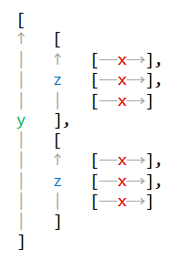

# About
Tools for working with Minecraft structure files. To inspect structure files use an NBT editor, 
such as [NBTExplorer](https://github.com/jaquadro/NBTExplorer).

# :warning: Warning
Keep in mind that vanilla Minecraft officially only supports 32\*32\*32 structures. Currently you can 
load structures with larger sizes by powering a structure block with redstone, the "LOAD" button 
of the structure block does not work for them.    
It is also possible to write a fake size and have the structure place blocks and entities outside of 
this size.

All of this is not officially supported, might be unstable and not work in the future anymore. Consider 
using other means of placing blocks, like splitting them into 32\*32\*32 structures, using commands or 
sharing the world (depending on your usage) since structure blocks are not as efficient when it comes 
to large structures.

# Usage
Releases can be found under the [releases tab](https://github.com/Marcono1234/structure-tools/releases). 
They might not reflect the latest changes.   
You can also try building the program from source as described in the section [Building from source](#building-from-source).

This program is a command line tool, you can start it with `java -jar <jar-name> <args>`. After the 
jar-name you have to provide arguments. To run a command use `command <command-name> <command-args>`. 
There will be a (hopefully) useful error message in case you provide too few command arguments.

## Commands
### glue
"Glues" together multiple structure files to one large structure file. It is assumed that the size 
of each structure file is the vanilla maximum (even if the `size` tag says otherwise). The program 
will refuse to glue structures if their size or the blocks or entities it places are outside these 
bounds since they might interfere with neighboring structures. If you want to glue structures which 
are smaller or larger than the maximum size, you can load and lay them out in Minecraft, save them 
as maximum sized structures and then glue them.

#### Arguments
`glue <config-file> <layout-file> <output-file-path>`

##### `config-file`    
JSON file specifying the configuration:

|Name           |Type   |Default value|Description|
|---------------|-------|-------------|-----------|
|`author`       |String |`null`       |The author to write to the structure file, `null` means no author should be written.|
|`dataVersion`  |Integer|`null`       |The Minecraft data version to write to the structure file, `null` means the highest data version of all structures is used. The data version for a Minecraft version can for example be found on the respective [Minecraft Wiki](https://minecraft.gamepedia.com/Minecraft_Wiki) article for that version.|
|`writeFakeSize`|Boolean|`true`       |Whether the maximum vanilla size should be written as size. This allows loading the structure using the "LOAD" button of the structure block GUI.|

###### Example
```json
{
  "author": "Marcono1234",
  "writeFakeSize": true
}
```

##### `layout-file`
JSON file specifying how the structures should be layed out. The file contains a three-dimensional 
array containing the structure file paths. The first dimension is the y-, the second one the 
z- and the third the x-axis. The y- and z-arrays are reversed to be a little bit more intuitive 
for the user:



Lists can be empty and elements can be `null` to omit an entry. Only specified structures are used 
to determine the glued structure size, trailing empty entries are ignored.

###### Example
Let's say you have three structures:
- `x1y0z0.nbt`
- `x0y0z1.nbt`
- `x0y1z0.nbt`

And want to lay them out corresponding to their name. Then the layout file could look like this:
```json
[
  [
    ["x0y1z0.nbt"]
  ],
  [
    ["x0y0z1.nbt"],
    [null, "x1y0z0.nbt"]
  ]
]
```

##### `output-file-path`
File path including extension which should be used for the glued structure, for example `glued.nbt`.

# Building from source
This project uses Maven which allows you to use the normal build phases, such as `package`. Packaging 
uses the [Shade Plugin](https://maven.apache.org/plugins/maven-shade-plugin/) which creates a "fat-jar" / 
uber-jar which contains all dependencies and can be used as is.

The dependency [Querz NBT](https://github.com/Querz/NBT) requires you to install the project to your 
local Maven repository since there is (at least to my knowledge) no public repository containing it. 
See for example [this StackOverflow answer](https://stackoverflow.com/a/6123981), describing how to 
install a gradle project to the local Maven repository.
